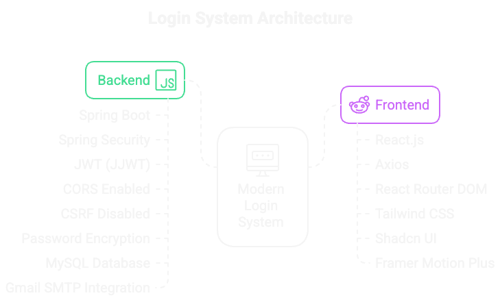
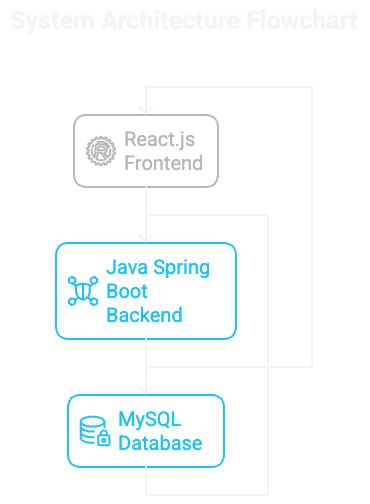

# Login System

- 🔥 **Modern login system with Java Spring Boot backend**
  - Uses **Spring Security** and **JWT** for authentication
  - Connected to a **MySQL** database
  - Backend handles **password encryption**
  - Sends automatic registration emails via **Gmail SMTP**
  - Supports Apple Login and Google Login for **seamless OAuth authentication**
    - Mobile app (React Native) integrates with **Apple** and **Google SDKs**
    - Backend verifies provider tokens **(Apple identity token / Google ID token)**
    - Automatically creates or links user accounts on first login
    - Generates JWT tokens after successful OAuth validation

## Architecture Diagram

  

  

