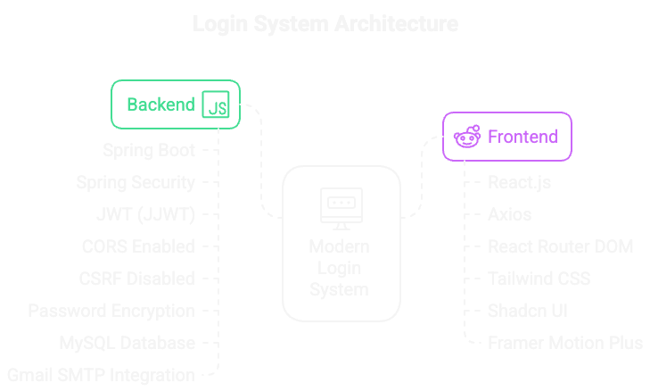
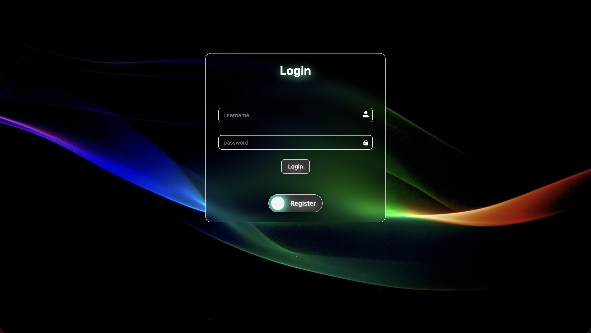

# Login System

- Modern login system with Java Spring Boot backend
- Uses Spring Security and JWT for authentication
- Connected to a MySQL database
- Backend handles password encryption
- Sends automatic registration emails via Gmail SMTP
- Frontend built with React.js
- Styled using Tailwind CSS and Shadcn UI
- Axios used for API calls
- React Router for page navigation

## Architecture Diagram

  
  

## UI Preview

